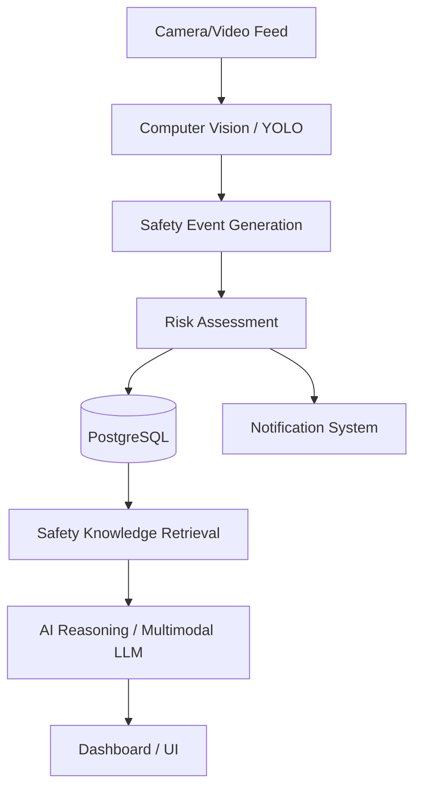

# SafeVision-AI Project Report

## 1. Introduction

SafeVision-AI is an intelligent, multimodal safety monitoring platform that integrates Computer Vision (YOLO), a deterministic Risk Engine, and a Retrieval-Augmented Generation (RAG) system using ChromaDB to process and analyze workplace safety events. It leverages advanced LLMs (Google Gemma via OpenRouter, with an Ollama fallback) to generate AI Safety Insights from video telemetry and safety policy documents.

## 2. Problem Statement

Workplace safety monitoring often relies on manual observation or rigid, non-contextual camera alerts. When safety incidents occur, safety managers lack immediate, context-aware analysis that cross-references the event against company safety policies (SOPs) and historical patterns.

## 3. Objectives

- Automate safety monitoring using YOLO object detection.
- Assess risk deterministically based on zones and event types.
- Generate multimodal AI Safety Insights by cross-referencing visual evidence and telemetry against a RAG-based knowledge base of safety policies.
- Provide real-time notifications via Email and WhatsApp.

## 4. Existing System

Current implementations typically lack automated multimodal AI analysis and RAG integration, relying only on basic motion detection or single-purpose CV models without policy grounding.

## 5. Proposed System

The proposed SafeVision-AI system implements a full pipeline: Camera Feed -> CV Inference (YOLO) -> Deterministic Risk Assessment -> RAG Policy Grounding -> Multimodal AI Analysis (Gemma) -> Dashboard/Alerts/Notifications.

## 6. Scope of Project

The project covers the backend API (FastAPI), frontend dashboard (React/TypeScript), CV pipeline, RAG document management, and AI orchestration. Hardware integration (cameras) is simulated via video feeds or API endpoints.

## 7. Requirements

### 7.1 Functional Requirements
- Real-time event monitoring
- RAG-based document ingestion (PDFs)
- AI Safety Insights generation
- Alert resolution and tracking
- Email and WhatsApp notifications

### 7.2 Safety Knowledge Requirements
- PPE policies (verified in code)
- Emergency procedures
- Organization safety rules

### 7.3 Data Requirements
- Safety events and detections
- Visual evidence (annotated frames)
- Risk scores and alerts
- AI insights
- Organization/tenant data

## 8. System Design / Architecture

The system follows a modular architecture:

*Supporting Systems*: PostgreSQL for relational data, ChromaDB for vector embeddings, OpenRouter (Gemma) & Ollama for LLM inference, Twilio for WhatsApp, SMTP for Email.

## 9. Methodology / Working

The system operates by capturing inference data from the CV module, which is evaluated by a deterministic risk engine. If the risk exceeds thresholds, an alert is generated. The AI module retrieves relevant safety guidelines via RAG, bundles them with the visual evidence, and requests a comprehensive safety insight from the LLM.

## 10. Modules

- **Computer Vision Module**: YOLO inference, tracking, frame annotation.
- **Event & Risk Engine**: Event persistence, deterministic risk calculation.
- **RAG / Knowledge Base**: PDF ingestion, chunking, ChromaDB vector search.
- **AI Orchestration**: OpenRouter Gemma and Ollama fallback integrations.
- **Notification Module**: SMTP and Twilio WhatsApp routing.
- **Auth & RBAC**: JWT, organization isolation, role permissions.
- **Ollama Fallback**: Uses `qwen2.5:3b-instruct` when OpenRouter fails.

## 11. Implementation

Implementation details verified from code:
- **Backend**: FastAPI, SQLAlchemy, Alembic, JWT auth.
- **Frontend**: React, Vite, Tailwind CSS, Lucide Icons.
- **AI**: Multimodal prompt formatting sending Base64 images to OpenRouter.

## 12. Testing

Testing is implemented using `pytest` for the backend. Inspected `tests/test_ai_reasoning.py` which verifies AI insight generation and fallback behavior.

## 13. Results / Output

Outputs verified in the system include:
- PPE violation events
- Risk classifications and alerts
- Annotated evidence frames
- RAG retrieval of safety documents
- AI insights (Multimodal & Fallback)
- Multimodal prompts dynamically assembling CV telemetry and RAG context.

## 14. Advantages & Limitations

### Advantages
- Deep, evidence-grounded safety intelligence.
- Strict tenant isolation and RBAC.
- Comprehensive fallback architecture.

### Limitations (Verified Known Issues)
- **OpenRouter Rate Limiting**: The free tier of `google/gemma-4-26b-a4b-it:free` on OpenRouter experiences frequent upstream shared-pool rate limiting (429/502). This triggers a fallback to the text-only Ollama (`qwen2.5:3b-instruct`), omitting visual evidence from the analysis.
- Twilio WhatsApp is currently running in Sandbox mode.

## 15. Future Scope

- Implementation of BYOK (Bring Your Own Key) for dedicated LLM providers to avoid rate limits.
- Enhanced reporting (Export Report feature verification pending).
- Predictive safety analytics based on historical patterns.

## 16. Conclusion

SafeVision-AI successfully demonstrates a modern, AI-augmented safety management platform. While rate limits on free-tier LLMs present a challenge, the robust fallback mechanisms and comprehensive RAG integration ensure continuous operation and contextual safety intelligence.

